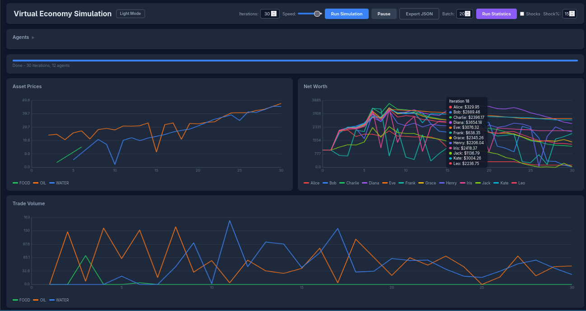

## Overview

Virtual Economy is a browser-based market simulation where autonomous agents
trade three commodities (FOOD, OIL, and WATER) using a variety of competing
strategies. The simulation runs entirely in JavaScript, with an optional Python
backend for persistence and multi-tab synchronization.

Agents are initialized with a cash balance and equal holdings of each asset.
Each iteration they apply their strategy: buying underpriced listings, posting
sell orders, hoarding a preferred asset, or reacting to price momentum, while a
0.5% transaction fee drains liquidity over time. Price history, trade volume,
and per-agent net worth are tracked across iterations and displayed as live
charts.

Shock events can be injected mid-simulation to stress-test how strategies
respond to sudden supply or demand shifts. Batch mode lets you run many trials
back-to-back and export the results as JSON for further analysis.

<p align="center">
  
</p>

## Features

- Multi-agent simulation with 12 built-in trading strategies
- Live price history, trade volume, and net worth charts
- Configurable agents: add, remove, or change strategies mid-run
- Shock events to simulate sudden market disruptions
- Adjustable simulation speed and pause/resume control
- Batch trial mode for running many simulations in sequence
- JSON export of simulation data for offline analysis
- Dark mode toggle
- Optional Python/SQLite backend for persistent state

## Strategies

| Strategy | Behavior |
|---|---|
| chaos | Random buys and sells at arbitrary prices |
| flipper | Buys the cheapest listing and immediately relists at +25% |
| hoarder | Accumulates FOOD regardless of price |
| sniper | Only buys listings priced below a fixed threshold |
| undercut | Continuously relists all holdings one cent below the market low |
| value-investor | Buys below the mean listing price; sells above it |
| momentum | Chases the asset with the strongest recent price trend |
| trend-follower | Follows the direction of the last price move |
| mean-reversion | Bets that prices return toward their recent average |
| scalper | Makes many small trades to capture small spreads |
| contrarian | Bets against the current momentum |
| hodler | Never sells |

## Usage

Open `public/index.html` directly in a browser for a fully self-contained
simulation, or run the Python backend and visit `http://localhost:8000` for
persistent storage:

```
python3 server.py
```

## Dependencies

## License

This work is licensed under the GNU General Public License version 3 (GPLv3).

[](https://www.gnu.org/licenses/gpl-3.0.en.html)
